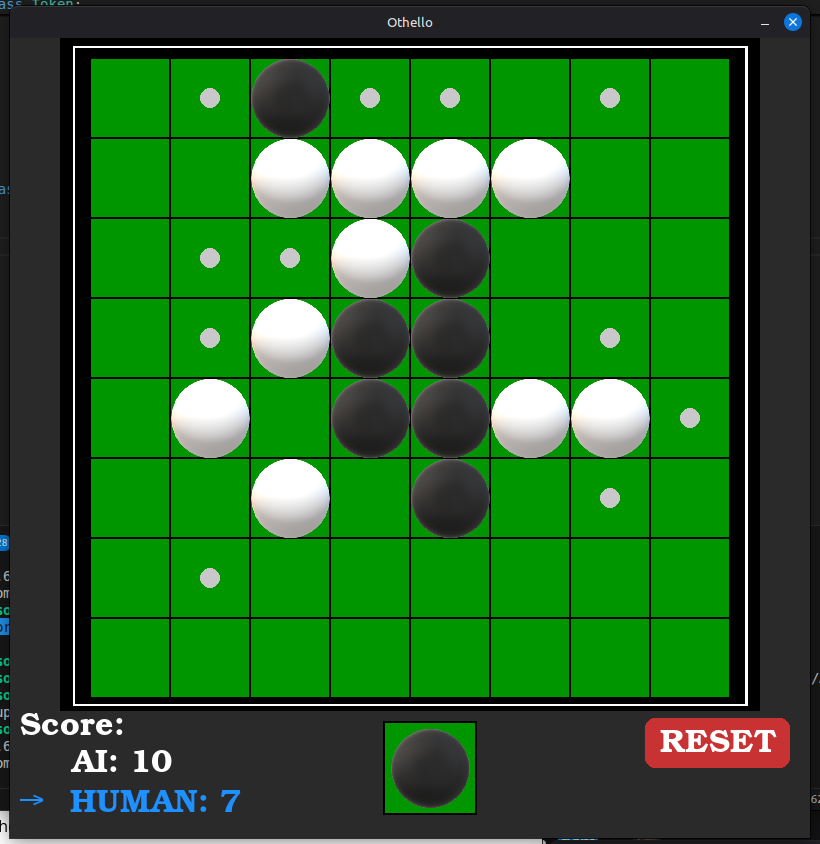

# Othello (Reversi) with Agent using a Minimax Algorithm

This is a game of Othello where a human plays a computer opponent that uses the minimax algorithm. A human can also play against a human as well.

## Authors

- Sepehr Naji
- Mason Jennings

## Usage

This game was tested on Windows 11 and Ubuntu OS. To launch the game, install the python module `pygame`. This is usually done by creating a python virtual environment:

``` bash
python3 -m venv env
source env/bin/activate
pip install pygame
```

### Launching the game
``` bash
python polished_othello.py
```

## Screenshot



## Citations

This Othello implementation was inspired by:

- *tutorial by HBCoding (*game mechanics only*)*: [Othello Reversi Tutorial](https://youtube.com/playlist?list=PLTJZtmCSZESJ6Sf1DcjMxQpRhAq13J220&si=qUWqPEHrKKVJDk4i)
- *minimax search algorithm from AIMA*: [MiniMax Search Algorithms](https://github.com/aimacode/aima-python/blob/master/games4e.ipynb)
